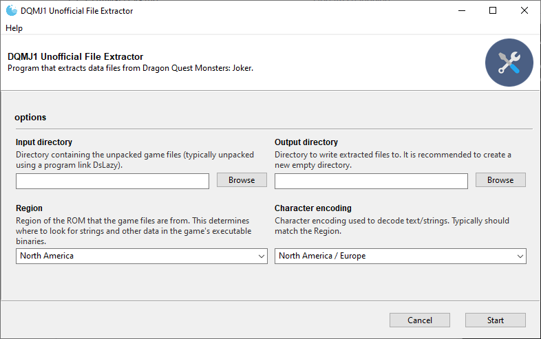

# dqmj1_info
A set of tools for extracting and working with data and files from the game *Dragon Quest Monsters: Joker*.



## Download
Download the latest release of dqmj1_info for your operating system at the link below:

https://github.com/ExcaliburZero/dqmj1_info/releases

## Development
### Installation
```bash
git clone https://github.com/ExcaliburZero/dqmj1_info.git
cd dqmj1_info
pip install -e .
```

### Usage
```bash
dqmj1_extract_files --input_directory ../NDS_UNPACK_DQMJ1 --output_directory current_data
```

### Creating a new release
For instructions on how to create a new release, see: [RELEASE.md](RELEASE.md)

## Thanks
* Friks and Bonnford from the DQMJ Speedrunning Discord server for helping to interpret extracted game data and many other things.
* axx1611 for the work that they did on an open source Japanese save editor for DQMJ1. They identified many parts of the save file format that I did not figure out. ([original repo](https://github.com/axx1611/dqmjse), [fork with additional info and a compiled exe](https://github.com/ExcaliburZero/dqmjse))